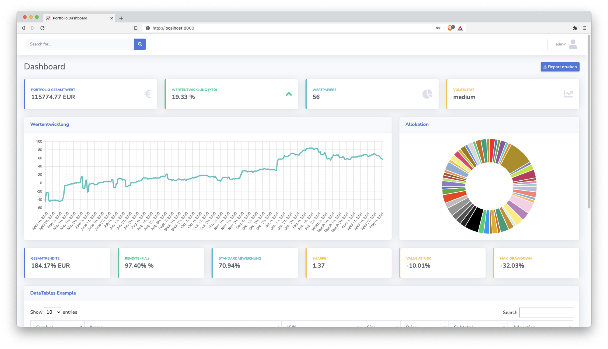
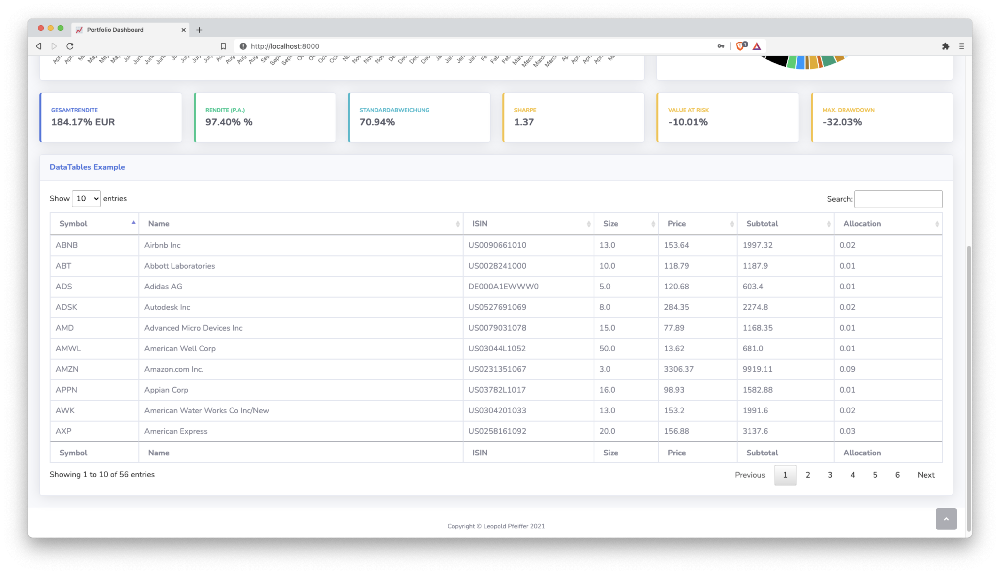

# Portfolio Dashboard
Custom Portfolio Dashboard for your Degiro account built with Django

## Getting started

### Build with docker-compose
Run

```shell
sh setup.sh
```

from the project root. This will create a `.env` file (if none exists) and builds the container.
Migrations are also applied right away and a superuser is created so that you can login.

This superuser has the credentials

```
username: admin
password: admin
```

Delete this user and create your own once you're ready.

You should now be able to access the dashboard on `localhost:8000`.


### Run without build

Alternatively, you can run the django directly without building the container. However, 
this requires to have a Postgres database running on your system. 

1. Generate `.env` file
   
You will need a `.env` file, which you can create by running

```shell
sh generate_dotenv.sh
```

and filling out the environment variables the way you need them.

2. Create a virtual environment

```shell
python -m virtualenv venv
source venv/bin/activate
```

3. Install the requirements
```shell
pip install -r requirements.txt
```

4. Run migrations and generate superuser
```shell
python manage.py migrate
python manage.py loaddata ./project/fixtures/admin.json
```

As before, the default superuser will have the credentials

```
username: admin
password: admin
```

Delete this user and create your own once you're ready.

5. Start the app
```shell
python manage.py runserver 0.0.0.0:8000
```

You should now be able to access the dashboard on `localhost:8000`.

## Screenshots
The app contains a dashboard view for you Degiro Portfolio.



## Technologies
- [Django](https://www.djangoproject.com/) for the general project setup
- Degiro API loosely based on [this repository](https://github.com/bramton/degiro).
- PostgreSQL database for persistent storage
- [Docker Compose](https://docs.docker.com/compose/) for containerization
- [SB Admin 2](https://startbootstrap.com/theme/sb-admin-2) bootstrap template for the frontend
